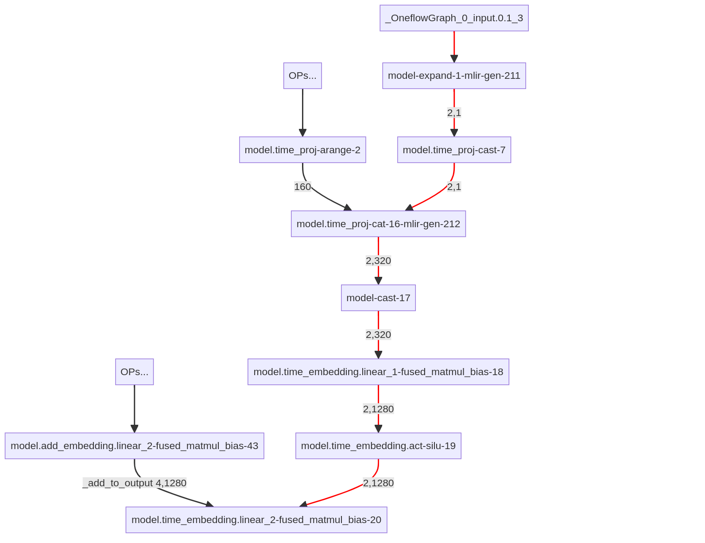

# > Internship in OneFlow

This is the summary of my internship experience at OneFlow.

TL;NR: I helped with compiling Stable Diffusion models by OneFlow.

## > What is OneFlow? Uhhh, I mean, as a framework but not a company?

OneFlow, a company known for its flagship product, a high-speed AI compiler, shares the same name as its main offering. In essence, OneFlow the framework seamlessly integrates with PyTorch, providing comprehensive support for compiling PyTorch models and enabling further optimizations.

In the open-source GitHub repository for onediff (a drop-in acceleration library for ComfyUI, HF diffusers, Stable Diffusion web UI, and other diffusion models), there are clear examples on how to use OneFlow for compilation.

And here is a piece of an instance:

```Python
base = StableDiffusionXLPipeline.from_pretrained(
    args.base,
    scheduler=scheduler,
    torch_dtype=torch.float16,
    variant=args.variant,
    use_safetensors=True,
)
base.to("cuda")
base.unet = oneflow_compile(base.unet, options={"debug": 0})
imageprocessor = base(
    prompt=args.prompt,
    height=args.height,
    width=args.width,
    num_inference_steps=args.n_steps,
    output_type=OUTPUT_TYPE,
)
image = imageprocessor.images
image[0].save(f"h{args.height}-w{args.width}-{args.saved_image}")
```

`oneflow_compile` wraps the a `torch.module` and concealedly creates a OneFlow graph to substitute for the original `torch.module`. In calling `base` pipeline, `base.unet` finds itself as a OneFlow graph and falls into OneFlow workflow.

In the OneFlow workflow, the first task is **compilation** (if the under-compiled graph has not been compiled yet), which involves optimizing the graph by fusing, replacing, and removing nodes. 
Subsequently, the compiled graph is ready for **inferring** the results based on the given inputs.

## > Internship begins, but with bugs.

My first job is about resolving a shape-related bug.

### > Bug description

Let me continue writing the above example code by adding one more workflow

```python
imageprocessor = base(
    prompt=[args.prompt, args.prompt],
    height=args.height,
    width=args.width,
    num_inference_steps=args.n_steps,
    output_type=OUTPUT_TYPE,
)
image = imageprocessor.images
image[0].save(f"h{args.height}-w{args.width}-{args.saved_image}")
```

at the end.

Different from the above code, the new code snippet change the input from one prompt to two prompts, thus extending the batch size.
Then the bug shows up with such error message: `(4, 1280) != (2, 1280), shape mismatch`. Interestingly, this bug will not be triggered if I remove the first workflow, implying that the culprit stays inbetween the two workflows.

Before the start of the second workflow, OneFlow examines whether there exists a previously compiled graph that can be reused for the upcoming workflow in order to reducing the consumption of unnecessary recompilation. Fortunately, the compiled unet in the first workflow is ***shared***. The only thing we need to do is update it to a tiny extent to let it adapt to the size of new inputs.Unfortunately, the update of a unfriendly operator, `expand`, fails.

To understand the problem intuitively, I construct the following partial graph. Red color represents the data flow where the incorrect shape is introduced. Op `model.time_embedding.linear_2-fused_matmul_bias-20` meets such mismatch between (4, 1280) and (2, 1280) where (4, 1280) is the correct shape. 



The shape error originates from `model-expand-1-mlir-gen-211`, an automatically fused operator by MLIR from `expand-dim` and `expand`. `model-expand-1-mlir-gen-211` can expand a small shape into a bigger one following a hardcoded attribute. For instance, given an attribute (4, 100), it can accept an input of (4, 1) and expand its shape to (4, 100). Such operation is detrimental to dynamic shape operations. 

Basically, the support of dynamic shape builds on the batch-size-agnostic nature. For instance, if a matmul operator contains a weight of shape [4, 5], then it can accepts inputs of varing batch sizes as long as the second dimension is 4.  In contrast, `model-expand-1-mlir-gen-211` requires prior knowledge of the batch size before expanding a smaller shape into a larger one. If the batch size changes, such as from 4 to 3, the `model-expand-1-mlir-gen-211` operator may lead to incorrect shape expansion, resulting in the observed bug, or immediately crashes since the expansion is illegal. In order to fix this bug, it is crucial to update the expanding attribute when modifying the shared compiled graph. To this end, my code patch extracts the new batch size and rewrites the attribute of `model-expand-1-mlir-gen-211`. Until then, the bug has been successfully killed.