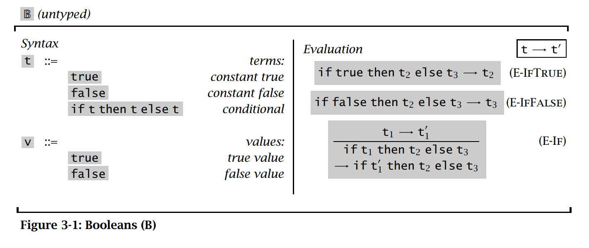
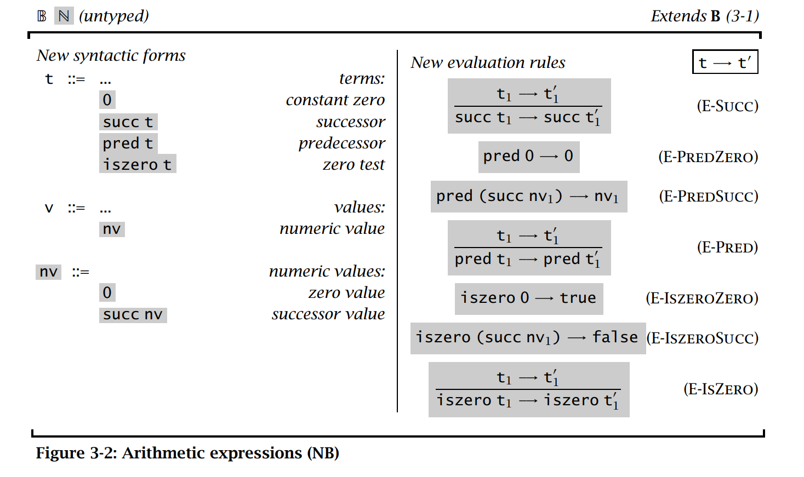
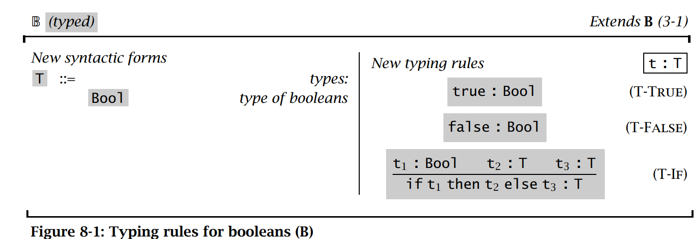
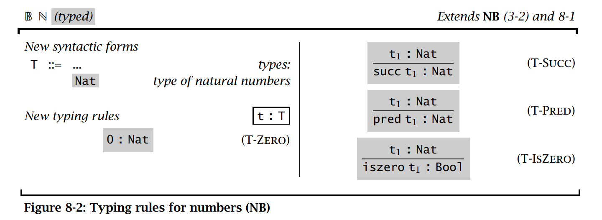
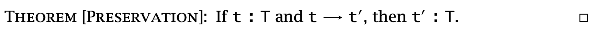
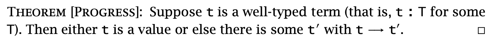

# A simple formal proof for Typed Arithmetic Expressions in TAPL

I read **Types and Programming Languages** (TAPL) these days and was deeply impressed by the beauty of
programming language. To practice proofs related to programming language theory and use of the Coq language, I formalize the following syntax and semantics in Coq and prove **Progress** and **Preservation** theory.









And here is the Coq code.

```Coq
Inductive type : Type :=
  | B (*boolean*)
  | N (*nat*)
  .

Inductive term : Type :=
  | boolean (b : bool)
  | if_then_else (t1 t2 t3 : term) (* if t1 then t2 else t3 *)
  | zero
  | succ (t: term) 
  | iszero (t : term)
  | pred (t : term).

(* number value *)
Inductive nvalue : term -> Prop :=
  | NZero : nvalue zero
  | NSucc : forall (t:term), nvalue t -> nvalue (succ t).

Inductive value : term -> Prop :=
  | BValue : forall (t : term) (b : bool), t = boolean b -> value t
  | NValue : forall (t : term), nvalue t -> value t.

Inductive evaluate : term -> term -> Prop :=
  | E_SUCC :
    forall (t1 t2 : term),
    evaluate t1 t2 ->
    evaluate (succ t1) (succ t2)
  | E_PREDZERO :
    evaluate (pred zero) zero
  | E_PREDSUCC :
    forall (t : term),
    nvalue t ->
    evaluate (pred (succ t)) t
  | E_PRED :
    forall (t1 t2 : term),
    evaluate t1 t2 ->
    evaluate (pred t1) (pred t2)
  | E_ISZEROZERO :
    evaluate (iszero zero) (boolean true)
  | E_ISZEROSUCC :
    forall (t : term),
    nvalue t ->
    evaluate (iszero (succ t)) (boolean false)
  | E_ISZERO :
    forall (t1 t2 : term),
    evaluate t1 t2 ->
    evaluate (iszero t1) (iszero t2)
  | E_IFTRUE :
    forall (t2 t3 : term),
    evaluate (if_then_else (boolean true) t2 t3) t2
  | E_IFFALSE :
    forall (t2 t3 : term),
    evaluate (if_then_else (boolean false) t2 t3) t3
  | E_IF :
    forall (t1 t2 t3 t1' : term),
    evaluate t1 t1' ->
    evaluate (if_then_else t1 t2 t3) (if_then_else t1' t2 t3).

Notation "x \-> y" := (evaluate x y) (at level 50, left associativity).


Inductive typeCheck : term -> type -> Prop :=
  | CheckTrue : typeCheck (boolean true) B
  | CheckFalse : typeCheck (boolean false) B
  | CheckIf (T:type) (t1 t2 t3 : term):
    typeCheck t1 B ->
    typeCheck t2 T ->
    typeCheck t3 T ->
    typeCheck (if_then_else t1 t2 t3) T
  | CheckZero : typeCheck zero N
  | CheckSucc :
    forall (t:term),
    typeCheck t N ->
    typeCheck (succ t) N
  | CheckPred :
    forall (t:term),
    typeCheck t N ->
    typeCheck (pred t) N
  | CheckIszero :
    forall (t:term),
    typeCheck t N ->
    typeCheck (iszero t) B.

Notation "t :: T" := (typeCheck t T).

(* A trick here *)
Lemma typeCheck_number_is_not_B:
forall t, nvalue t -> t :: B -> False.
Proof.
  intros. 
  induction H; inversion H0. 
Qed.

(** [Canonical Form (Page 127) (1)] If [v] is a value of type [Bool],
then [v] is either [true] or [false]*)
Lemma boolvalue_only_contains_true_or_false :
forall (t:term), value t -> t :: B -> t = boolean true \/ t = boolean false.
Proof.
  intros. remember t as t'. remember B as T. induction H0.
  - left. reflexivity.
  - right. reflexivity.
  - inversion H. discriminate. inversion H0.
  - discriminate.
  - discriminate.
  - discriminate.
  - inversion H.
    + discriminate.
    + inversion H1. 
Qed.

(* (** [Canonical Form (Page 128) (2)] If [v] is a value of type [Nat],
then [v] is a [number]*)
Lemma numvalue_only_contains_zero_or_succ :
forall (t:term), nvalue t -> t = zero \/ exists (t' : term), nvalue t' -> 
Proof.
  intros. remember N as type_. induction H0; try discriminate.
  - remember (if_then_else t1 t2 t3) as ifH. destruct H; rewrite HeqifH in H;
    discriminate.
  - exists zero; reflexivity.
  - exists (succ n); reflexivity.
  - remember (pred t) as predn.
    destruct H eqn:E.
    + rewrite e in Heqpredn; discriminate.
    + rewrite e. exists n; reflexivity. 
Qed. *)


(* [exists (tp : type), typeCheck t tp] means term [t] is well-typed *)
Theorem Progress : forall (t:term), (exists (tp : type), t :: tp) -> 
  value t \/ (exists (t':term), t \-> t').
Proof. 
  intros. destruct H. 
  induction H.
  - left. apply BValue with (b:=true). reflexivity.
  - left. apply BValue with (b:=false). reflexivity.
  - right.  
    destruct IHtypeCheck1.
    + inversion H2.
      -- destruct b; rewrite H3.
         ++ exists t2. apply E_IFTRUE.
         ++ exists t3. apply E_IFFALSE.
      -- inversion H3; inversion H.
         ++ rewrite <- H5 in H6; discriminate.
         ++ rewrite <- H5 in H6; discriminate.
         ++ rewrite <- H5 in H9; discriminate.
         ++ rewrite <- H5 in H7; discriminate.
         ++ rewrite <- H6 in H7; discriminate.
         ++ rewrite <- H6 in H7; discriminate.
         ++ rewrite <- H6 in H10; discriminate.
         ++ rewrite <- H6 in H8; discriminate.
    + destruct H2.
      exists (if_then_else x t2 t3).
      apply E_IF.
      apply H2.
  - left. apply NValue. apply NZero.
  - destruct IHtypeCheck.
    + left. apply NValue. inversion H0.
      -- rewrite H1 in H. inversion H.
      -- apply NSucc. apply H1.
    + destruct H0.
      right. exists (succ x).
      apply E_SUCC. apply H0.
  - right.
    destruct IHtypeCheck.
    + inversion H0.
      -- rewrite H1 in H. inversion H.
      -- destruct H1.
         ++ exists zero. apply E_PREDZERO.
         ++ exists t. apply E_PREDSUCC. apply H1.
    + destruct H0.
      exists (pred x).
      apply E_PRED.
      apply H0.
  - right. destruct IHtypeCheck.
    + inversion H0.
      -- rewrite H1 in H. inversion H.
      -- destruct H1.
         ++ exists (boolean true). apply E_ISZEROZERO.
         ++ exists (boolean false). apply E_ISZEROSUCC. apply H1.
    + destruct H0.
      exists (iszero x).
      apply E_ISZERO.
      apply H0.
Qed. 

Axiom pred_succ_is_itself:
forall (t:term), pred (succ t) = t.

Lemma succ_t_is_of_N_then_t_is_also_of_N :
forall (t:term), succ t :: N -> t :: N.
Proof.
  intros.
  inversion H.
  apply H1.
Qed.

(** If [t] : [T] and [t] -> [t'], then [t'] : [T]*)
Theorem Preservation :
forall (t t':term) (T:type), t :: T -> (t \-> t') -> t' :: T.
Proof. (* induction on type system , could also do induction on evaluation*)
  intros.
  generalize dependent t'.
   induction H; intros.
  - inversion H0. (* cannot evaluate (boolean true)*)
  - inversion H0. (* cannot evaluate (boolean false)*)
  - remember B as B'. destruct H.
    + inversion H2.
      -- rewrite <- H5. apply H0.
      -- inversion H6.
    + inversion H2.
      -- rewrite <- H5. apply H1.
      -- inversion H6.
    + rewrite HeqB' in H3;
      rewrite HeqB' in H4;
      rewrite HeqB' in IHtypeCheck1.
      clear HeqB'.
      inversion H2.
      apply CheckIf.
      -- apply IHtypeCheck1 in H9. apply H9. (* auto *)
      -- apply H0.
      -- apply H1.
    + discriminate.
    + discriminate.
    + discriminate.
    + inversion H2. apply CheckIf.
      -- auto.
      -- apply H0.
      -- apply H1.
  - inversion H0.
  - inversion H0; clear H1.
    apply IHtypeCheck in H2. apply CheckSucc. apply H2.
  - inversion H0.
    + apply CheckZero.
    + rewrite <- H1 in H; rewrite <- H3.
      apply succ_t_is_of_N_then_t_is_also_of_N in H. apply H.
    + apply IHtypeCheck in H2. apply CheckPred. apply H2.
  - inversion H0.
    + apply CheckTrue.
    + apply CheckFalse.
    + apply IHtypeCheck in H2. apply CheckIszero. apply H2.             
Qed.
```

To better play with TAPL, I also collect several repos for implementing the theory in this book in [Github](https://github.com/haoyang9804/TAPL-all).