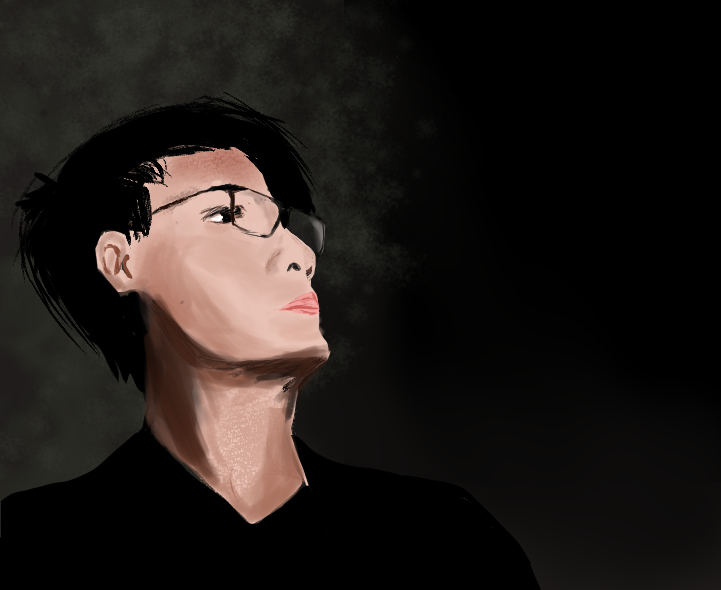
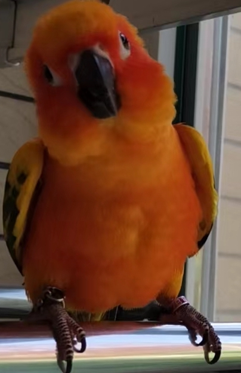

# MA, Haoyang(马昊阳)

<!--  -->

<!--  -->

<!--  -->

<!-- [Google Scholar](https://scholar.google.com/citations?user=0-iO7hsAAAAJ&hl=en)  -->

<!-- [Github](https://github.com/haoyang9804) -->

## About Me

---
I'm a PhD student at the Department of Computer Science and Engineering at HKUST, supervised by Prof. [Shing-Chi Cheung](https://www.cse.ust.hk/~scc/). I'm now a member of the [CASTLE Group](http://sccpu2.cse.ust.hk/castle/index.html). My research interests include ***Compiler Testing***, ***Bug Isolation*** and ***SE for AI***. I am also interested in ***compiler verification***.

Before I joined in CASTLE Group, I did research on compiler testing under the guidance of Prof. [Junjie Chen](https://sites.google.com/site/junjiechen08/) for more than one year when I was an undergraduate at Tianjin University.

<!-- <u> BTW, my English name is drawn from my favoriate football coach [Jürgen Klopp](kloppp.png). </u> -->

## Education

---

+ **Hong Kong University of Science and Technology** Department of Computer Science and Engineering
  
    PhD in Computer Science and Engineering
  
    Aug. 2021 ~ Now

+ **Tianjin University** College of Intelligence and Computing
  
    B.Eng. in Software Engineering
  
    Aug. 2016 ~ Jul. 2020

## Publications

> <i><u>\* denotes corresponding author, # denotes equal contribution</u></i>

---

+ [preprent](https://arxiv.org/abs/2306.06884) **A Survey of Modern Compiler Fuzzing** (In progress)

+ [ISSTA 2023](https://conf.researchr.org/home/issta-2023) **Fuzzing Deep Learning Compilers with HirGen** [preprint](https://arxiv.org/abs/2208.02193)
    
    <u>Haoyang Ma</u>, Qingchao Shen, Yongqiang Tian, Junjie Chen, Shing-Chi Cheung*

+ [FSE 2021](https://2021.esec-fse.org) **A Comprehensive Study of Deep Learning Compiler Bugs** [\[paper\]](A_Comprehensive_Study_of_Deep_Learning_Compiler_Bugs.pdf) [\[project\]](https://github.com/ShenQingchao/DLCstudy)

    Qingchao Shen, <u>Haoyang Ma</u>, Junjie Chen*, Yongqiang Tian, Shing-Chi Cheung, Xiang Chen

    <!-- *acceptance rate*: 24.5% (97 of 396) -->

+ [ASE 2020](https://conf.researchr.org/home/ase-2020) **Enhanced compiler bug isolation via memoized search** [\[paper\]](ASE_20__Reinforcement_Compiler_Bug_Isolation.pdf) [\[project\]](https://github.com/haoyang9804/RecBi)

    Junjie Chen\*#, <u>Haoyang Ma</u>#  , Lingming Zhang

    <!-- *acceptance rate*: 22.5% (93 of 408) -->

## Honors and Awards

---

+ Postgraduate studentship, HKUST, 2021 - 2025

## Teaching

---

I was the TA of 

+ COMP 3111 Software Engineering (Spring 2021-22).
+ COMP 2011 Programming With C++ (Fall 2022-23)

## Services

---

Have participated in (co-)reviewing paper(s) in ISSTA 2021, ISSTA 2023.
