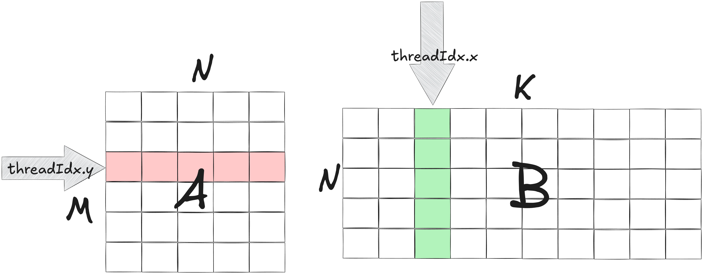
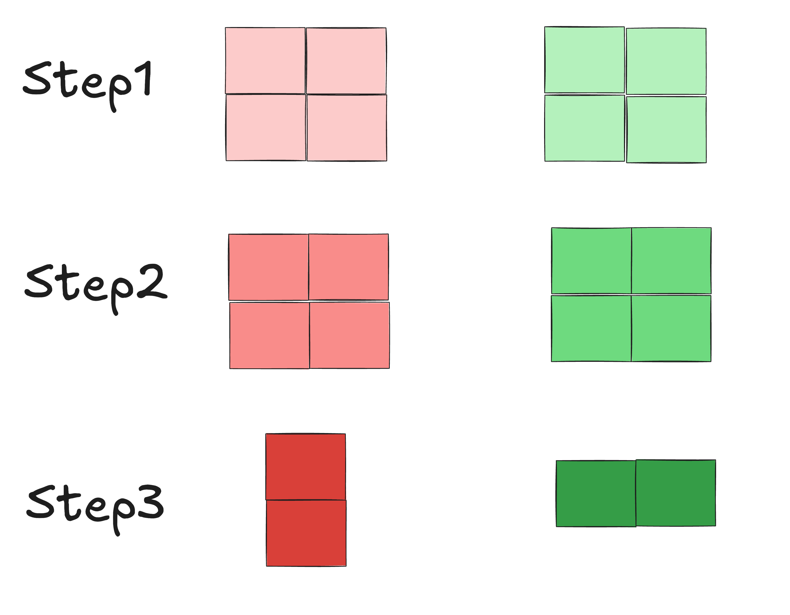

# matmul.cu

matmul可谓入门算子的基础中的基础。但即便基础，matmul也有不少优化。本文旨在通过探讨这个基础算子的几种写法，从最朴素的写法一步一步进行优化。

## 阅读本文需要什么基础？
本文是写给算子新手的，也是我作为新手写给自己用于复习总结的。
只要你懂如下代码在做啥，你就可以理解本文：
```cpp
#include <cuda_runtime.h>
__global__ void vector_add(const float* A, const float* B, float* C, int N) {
    int tid = blockIdx.x * blockDim.x + threadIdx.x;

    if(tid < N){
        C[tid] = A[tid] + B[tid];
    }
}

extern "C" void solve(const float* A, const float* B, float* C, int N) {
    int threadsPerBlock = 256;
    int blocksPerGrid = (N + threadsPerBlock - 1) / threadsPerBlock;

    vector_add<<<blocksPerGrid, threadsPerBlock>>>(A, B, C, N);
    cudaDeviceSynchronize();
}

```

## 题目描述

题目来自leetgpu。
矩阵$A$的shape为$M\times N$ ，矩阵B的shape为 $N\times K$, 他们都是float32 dtype，计算他们的矩阵乘并存入C。

## 先来个朴素的
```c++
#include <cuda_runtime.h>

constexpr int kTileM = 16;
constexpr int kTileN = 16; // reduce
constexpr int kTileK = 16;

__host__ __device__ static inline int ceil_div_int(int x, int y) {
    return (x + y - 1) / y;
}

__global__ void matrix_multiplication_kernel(const float* A, const float* B, float* C, int M, int N, int K) {

    for (int row_block = blockIdx.x; row_block < ceil_div_int(M, kTileM); row_block += gridDim.x) {
        for (int col_block = blockIdx.y; col_block < ceil_div_int(K, kTileK); col_block += gridDim.y) {
            int row = row_block * kTileM + threadIdx.x;
            int col = col_block * kTileK + threadIdx.y;
            if (row >= M || col >= K) {
                continue;
            }
            float sum = 0.0f;
            for (int k = 0; k < N; k += 1) {
                sum += A[row * N + k] * B[k * K + col];
            }
            C[row * K + col] = sum;
        }
    }
}

// A, B, C are device pointers (i.e. pointers to memory on the GPU)
extern "C" void solve(const float* A, const float* B, float* C, int M, int N, int K) {
    dim3 threadsPerBlock(kTileM, kTileK);
    dim3 blocksPerGrid((M + threadsPerBlock.x - 1) / threadsPerBlock.x,
                       (K + threadsPerBlock.y - 1) / threadsPerBlock.y);

    matrix_multiplication_kernel<<<blocksPerGrid, threadsPerBlock>>>(A, B, C, M, N, K);
    cudaDeviceSynchronize();
}

```
上述kernel对应的矩阵乘方式如下图所示


`threadIdx.x`对应这矩阵`A`的粉色行，`threadIdx.y`对应这矩阵`B的绿色列，在leetgpu上耗时


性能极差 :(
其中最容易发现的影响性能的操作是`threadidx.x`遍历`A`的行。
全局`thread id = threadIdx.x + blockDim.x * threadIdx.y`，因此，同一个 warp 内相邻线程访问 A 的地址跨度为 N 个元素（row stride），无法形成 coalesced memory access，因此产生大量全局内存事务，性能极差。
我们只需要调换`threadIdx.x`和`threadIdx.y`，就可以解决这个问题：



```cpp
#include <cuda_runtime.h>

constexpr int kTileM = 16;
constexpr int kTileN = 16; // reduce
constexpr int kTileK = 16;

__host__ __device__ static inline int ceil_div_int(int x, int y) {
    return (x + y - 1) / y;
}

__global__ void matrix_multiplication_kernel(const float* A, const float* B, float* C, int M, int N, int K) {

    for (int row_block = blockIdx.y; row_block < ceil_div_int(M, kTileM); row_block += gridDim.y) {
        for (int col_block = blockIdx.x; col_block < ceil_div_int(K, kTileK); col_block += gridDim.x) {
            int row = row_block * kTileM + threadIdx.y;
            int col = col_block * kTileK + threadIdx.x;
            if (row >= M || col >= K) {
                continue;
            }
            float sum = 0.0f;
            for (int k = 0; k < N; k += 1) {
                sum += A[row * N + k] * B[k * K + col];
            }
            C[row * K + col] = sum;
        }
    }
}

// A, B, C are device pointers (i.e. pointers to memory on the GPU)
extern "C" void solve(const float* A, const float* B, float* C, int M, int N, int K) {
    dim3 threadsPerBlock(kTileM, kTileK);
    dim3 blocksPerGrid((M + threadsPerBlock.y - 1) / threadsPerBlock.y,
                       (K + threadsPerBlock.x - 1) / threadsPerBlock.x);

    matrix_multiplication_kernel<<<blocksPerGrid, threadsPerBlock>>>(A, B, C, M, N, K);
    cudaDeviceSynchronize();
}

```


效果拔群 :)
但从这个percentile来看，还有很大进步空间。

## 朴素的不行，得玩点花活 - shared memory tiling
上面的kernel最大的问题是arithmetic intensity (AI) 不够
$$
AI = \frac{计算量}{\text{GPU 的 HBM（High Bandwidth Memory）读写的数据总量}}\ \ \text{FLOPs} / \text{Byte}
$$
kernel中的compute代码
```go
for (int k = 0; k < N; k += 1) {
	sum += A[row * N + k] * B[k * K + col];
}
```
每一次`sum += A[row * N + k] * B[k * K + col];`的flops为2(一个Fused Multiply-Add(FMA)的flops为2)；且由于A和B都是float32，每个元素4 bytes。
根据上述公式可得，每个thread的AI为
$$
AI = \frac{2N}{4N} = \frac{1}{2}
$$
这是一个很糟糕的数据。下表展示了近几代NV GPU的的$AI$。其中B200的peak tflops数据来自[8x NVIDIA Blackwell SXM](https://www.nvidia.com/en-us/data-center/hgx/?utm_source=chatgpt.com)的估算：8卡TF32 Tensor Core为18 PFLOPS with sparsity，因此，单卡约为 $18000/8=2250\ \text{TFLOPS}$

| GPU      |                                  Peak TFLOPS | HBM Bandwidth | $AI$ critical |
| -------- | -------------------------------------------: | ------------: | ------------: |
| A100 80G |   312 TFLOPS(TF32 Tensor Core with sparsity) |      2.0 TB/s |          ≈156 |
| H100 SXM |  989 TFLOPS (TF32 Tensor Core with sparsity) |     3.35 TB/s |          ≈295 |
| B200     | 2250 TFLOPS (TF32 Tensor Core with sparsity) |      8.0 TB/s |          ≈281 |

这些卡的$AI$都远高$\frac{1}{2}$，因此上述两个kernel是memory bound的。
在阐述如何提高$AI$以及为什么要提高$AI$前，我们先看看$AI$代表着啥。

下图展示了单卡上各个存储模块的带宽和延迟。其中，顺序大量访问取决于带宽水平，随机零散访问取决于延迟。图中可见，HBM这两个维度都远弱于上层存储模块，且HBM是启动kernel后，矩阵被放置的位置。
因此，从HBM读写往往是kernel性能的瓶颈。
[GPU bandwidth hierarchy](../pics/GPU-bandwidth-hierarchy.png)

上述两个kernel当前的$AI$低的一大原因是从HBM load一个数据做一次计算。然而矩阵$A$中每一个数据都会和多个数据做计算，比如$A[i][j]$会和$B[j][:]$做乘法。
因此，一个符合直觉的做法是把$A[i][j]$从HBM load到shared memory，在block内部的每个`thread id`对应的$B[j][k]$会从shared memory而非HBM load $A[i][j]$.
这种做法就是所谓的shared memory tiling。在写此类优化时，我们应该把load和compute分开：先考虑如何在一个block中以每个thread为最基本的“劳动个体”，让他们合力把矩阵块从HBM移动到shared memory；再考虑每个thread如何基于shared memory存的矩阵块进行计算。

如下图所示，在load的时候，每个thread都沿着reduce的方向(也就是$N$的方向)把几个数据load到shared memory。
图中绿色/粉色不同的深浅代表着不同的load轮数。即，每一次load都会沿着$B$的列load两个数据，沿着$A$的行load两个数据，
并且，一个block内的全部thread同时发力进行load，图中画出了相邻的两个thread load同一行$A$，相邻列$B$的场景。

假设一个block中`blockDim.x=2`, `$blockDim.y=2`，那么load完后的状态应该是

随后compute就在每次load后做局部计算即可。

代码如下：
```cpp
#include <cuda_runtime.h>

constexpr int kTileM = 32;
constexpr int kTileN = 32; // reduce
constexpr int kTileK = 32;

__host__ __device__ static inline int ceil_div_int(int x, int y) {
    return (x + y - 1) / y;
}

template <int m_block_size, int n_tile_size, int k_block_size>
__global__ void matrix_multiplication_kernel(const float* A, const float* B, float* C, int M, int N, int K) {
    // shared memory
    __shared__ float a_tile[m_block_size][n_tile_size];
    __shared__ float b_tile[n_tile_size][k_block_size];
    int local_row = threadIdx.y;
    int local_col = threadIdx.x;

    for (int row_block = blockIdx.x; row_block < ceil_div_int(M, m_block_size); row_block += gridDim.x) {
        for (int col_block = blockIdx.y; col_block < ceil_div_int(K, k_block_size); col_block += gridDim.y) {
            int row = row_block * m_block_size + local_row;
            int col = col_block * k_block_size + local_col;
            float sum = 0.0f;

            int total_threads = blockDim.x * blockDim.y;
            int tid = threadIdx.x + blockDim.x * threadIdx.y;
            for (int k0 = 0; k0 < N; k0 += n_tile_size) {
                // load
                for (int idx = tid; idx < m_block_size * n_tile_size; idx += total_threads) {
                    int a_row = idx / n_tile_size;
                    int a_col = idx % n_tile_size;
                    int global_a_row = row_block * m_block_size + a_row;
                    int global_a_col = k0 + a_col;
                    a_tile[a_row][a_col] =
                        (global_a_row < M && global_a_col < N) ? A[global_a_row * N + global_a_col] : 0.0f;
                }
                for (int idx = tid; idx < n_tile_size * k_block_size; idx += total_threads) {
                    int b_row = idx / k_block_size;
                    int b_col = idx % k_block_size;
                    int global_b_row = k0 + b_row;
                    int global_b_col = col_block * k_block_size + b_col;
                    b_tile[b_row][b_col] =
                        (global_b_row < N && global_b_col < K) ? B[global_b_row * K + global_b_col] : 0.0f;
                }
                __syncthreads();
                // compute
                #pragma unroll
                for (int k = 0; k < n_tile_size; ++k) {
                    sum += a_tile[local_row][k] * b_tile[k][local_col];
                }
                __syncthreads();
            }

            if (row < M && col < K) {
                C[row * K + col] = sum;
            }
        }
    }
}

// A, B, C are device pointers (i.e. pointers to memory on the GPU)
extern "C" void solve(const float* A, const float* B, float* C, int M, int N, int K) {
    if (M <= 0 || N <= 0 || K <= 0) {
        return;
    }

    dim3 threadsPerBlock(kTileK, kTileM);
    dim3 blocksPerGrid(ceil_div_int(M, kTileM),
                       ceil_div_int(K, kTileK));

    matrix_multiplication_kernel<kTileM, kTileN, kTileK><<<blocksPerGrid, threadsPerBlock>>>(A, B, C, M, N, K);
    cudaDeviceSynchronize();
}

```

这个版本的kernel的$AI$有大幅提升

$$
\begin{aligned}
AI
&=
\frac{
  m_{\mathrm{block}} \times n_{\mathrm{tile}} \times k_{\mathrm{block}}
}{
  m_{\mathrm{block}} \times n_{\mathrm{tile}}
  + k_{\mathrm{block}} \times n_{\mathrm{tile}}
} \\
&=
\frac{32 \times 32 \times 32}{32 \times 32 + 32 \times 32} \\
&= 16
\end{aligned}
$$

远优秀于之前的$\frac{1}{2}$。

这个优化在性能上有大幅提升。


